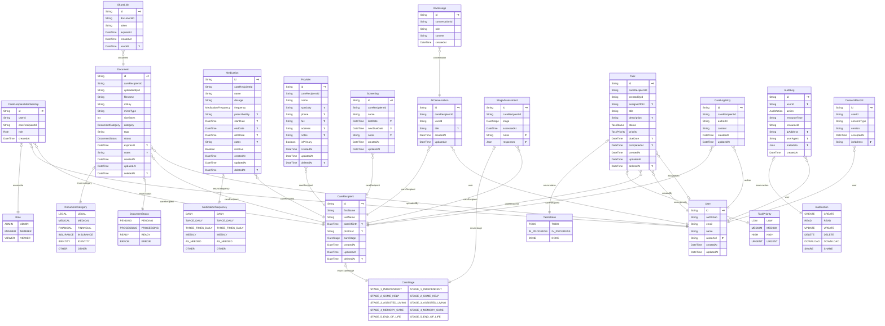

```mermaid
erDiagram

        Role {
            ADMIN ADMIN
MEMBER MEMBER
VIEWER VIEWER
        }
    


        DocumentCategory {
            LEGAL LEGAL
MEDICAL MEDICAL
FINANCIAL FINANCIAL
INSURANCE INSURANCE
IDENTITY IDENTITY
OTHER OTHER
        }
    


        DocumentStatus {
            PENDING PENDING
PROCESSING PROCESSING
READY READY
ERROR ERROR
        }
    


        MedicationFrequency {
            DAILY DAILY
TWICE_DAILY TWICE_DAILY
THREE_TIMES_DAILY THREE_TIMES_DAILY
WEEKLY WEEKLY
AS_NEEDED AS_NEEDED
OTHER OTHER
        }
    


        CareStage {
            STAGE_1_INDEPENDENT STAGE_1_INDEPENDENT
STAGE_2_SOME_HELP STAGE_2_SOME_HELP
STAGE_3_ASSISTED_LIVING STAGE_3_ASSISTED_LIVING
STAGE_4_MEMORY_CARE STAGE_4_MEMORY_CARE
STAGE_5_END_OF_LIFE STAGE_5_END_OF_LIFE
        }
    


        TaskStatus {
            TODO TODO
IN_PROGRESS IN_PROGRESS
DONE DONE
        }
    


        TaskPriority {
            LOW LOW
MEDIUM MEDIUM
HIGH HIGH
URGENT URGENT
        }
    


        AuditAction {
            CREATE CREATE
READ READ
UPDATE UPDATE
DELETE DELETE
DOWNLOAD DOWNLOAD
SHARE SHARE
        }
    
  "User" {
    String id "🗝️"
    String auth0Sub 
    String email 
    String name 
    String avatarUrl "❓"
    DateTime createdAt 
    DateTime updatedAt 
    }
  

  "CareRecipient" {
    String id "🗝️"
    String firstName 
    String lastName 
    DateTime dateOfBirth "❓"
    String photoUrl "❓"
    CareStage careStage 
    DateTime createdAt 
    DateTime updatedAt 
    DateTime deletedAt "❓"
    }
  

  "CareRecipientMembership" {
    String id "🗝️"
    String userId 
    String careRecipientId 
    Role role 
    DateTime createdAt 
    }
  

  "Document" {
    String id "🗝️"
    String careRecipientId 
    String uploadedById 
    String filename 
    String s3Key 
    String mimeType 
    Int sizeBytes 
    DocumentCategory category 
    String tags 
    DocumentStatus status 
    DateTime expiresAt "❓"
    String notes "❓"
    DateTime createdAt 
    DateTime updatedAt 
    DateTime deletedAt "❓"
    }
  

  "ShareLink" {
    String id "🗝️"
    String documentId 
    String token 
    DateTime expiresAt 
    DateTime createdAt 
    DateTime usedAt "❓"
    }
  

  "Medication" {
    String id "🗝️"
    String careRecipientId 
    String name 
    String dosage 
    MedicationFrequency frequency 
    String prescribedBy "❓"
    DateTime startDate "❓"
    DateTime endDate "❓"
    DateTime refillDate "❓"
    String notes "❓"
    Boolean isActive 
    DateTime createdAt 
    DateTime updatedAt 
    DateTime deletedAt "❓"
    }
  

  "Provider" {
    String id "🗝️"
    String careRecipientId 
    String name 
    String specialty "❓"
    String phone "❓"
    String fax "❓"
    String address "❓"
    String notes "❓"
    Boolean isPrimary 
    DateTime createdAt 
    DateTime updatedAt 
    DateTime deletedAt "❓"
    }
  

  "Screening" {
    String id "🗝️"
    String careRecipientId 
    String name 
    DateTime lastDate "❓"
    DateTime nextDueDate "❓"
    String notes "❓"
    DateTime createdAt 
    DateTime updatedAt 
    }
  

  "AiConversation" {
    String id "🗝️"
    String careRecipientId 
    String userId 
    String title "❓"
    DateTime createdAt 
    DateTime updatedAt 
    }
  

  "AiMessage" {
    String id "🗝️"
    String conversationId 
    String role 
    String content 
    DateTime createdAt 
    }
  

  "StageAssessment" {
    String id "🗝️"
    String careRecipientId 
    CareStage stage 
    DateTime assessedAt 
    String notes "❓"
    Json responses "❓"
    }
  

  "Task" {
    String id "🗝️"
    String careRecipientId 
    String createdById 
    String assignedToId "❓"
    String title 
    String description "❓"
    TaskStatus status 
    TaskPriority priority 
    DateTime dueDate "❓"
    DateTime completedAt "❓"
    DateTime createdAt 
    DateTime updatedAt 
    DateTime deletedAt "❓"
    }
  

  "CareLogEntry" {
    String id "🗝️"
    String careRecipientId 
    String authorId 
    String content 
    DateTime createdAt 
    DateTime updatedAt 
    }
  

  "AuditLog" {
    String id "🗝️"
    String userId "❓"
    AuditAction action 
    String resourceType 
    String resourceId 
    String ipAddress "❓"
    String userAgent "❓"
    Json metadata "❓"
    DateTime createdAt 
    }
  

  "ConsentRecord" {
    String id "🗝️"
    String userId 
    String consentType 
    String version 
    DateTime acceptedAt 
    String ipAddress "❓"
    }
  
    "CareRecipient" |o--|| "CareStage" : "enum:careStage"
    "CareRecipientMembership" |o--|| "Role" : "enum:role"
    "CareRecipientMembership" }o--|| "User" : "user"
    "CareRecipientMembership" }o--|| "CareRecipient" : "careRecipient"
    "Document" |o--|| "DocumentCategory" : "enum:category"
    "Document" |o--|| "DocumentStatus" : "enum:status"
    "Document" }o--|| "CareRecipient" : "careRecipient"
    "Document" }o--|| "User" : "uploadedBy"
    "ShareLink" }o--|| "Document" : "document"
    "Medication" |o--|| "MedicationFrequency" : "enum:frequency"
    "Medication" }o--|| "CareRecipient" : "careRecipient"
    "Provider" }o--|| "CareRecipient" : "careRecipient"
    "Screening" }o--|| "CareRecipient" : "careRecipient"
    "AiConversation" }o--|| "CareRecipient" : "careRecipient"
    "AiConversation" }o--|| "User" : "user"
    "AiMessage" }o--|| "AiConversation" : "conversation"
    "StageAssessment" |o--|| "CareStage" : "enum:stage"
    "StageAssessment" }o--|| "CareRecipient" : "careRecipient"
    "Task" |o--|| "TaskStatus" : "enum:status"
    "Task" |o--|| "TaskPriority" : "enum:priority"
    "Task" }o--|| "CareRecipient" : "careRecipient"
    "Task" }o--|| "User" : "createdBy"
    "Task" }o--|o "User" : "assignedTo"
    "CareLogEntry" }o--|| "CareRecipient" : "careRecipient"
    "CareLogEntry" }o--|| "User" : "author"
    "AuditLog" |o--|| "AuditAction" : "enum:action"
    "AuditLog" }o--|o "User" : "user"
    "ConsentRecord" }o--|| "User" : "user"
```
