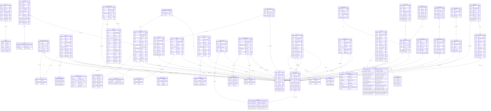

```mermaid
erDiagram

        Role {
            ADMIN ADMIN
COORDINATOR COORDINATOR
VIEWER VIEWER
        }
    


        DocumentCategory {
            LEGAL LEGAL
MEDICAL MEDICAL
FINANCIAL FINANCIAL
INSURANCE INSURANCE
IDENTITY IDENTITY
CARE_PLANS CARE_PLANS
OTHER OTHER
        }
    


        DocumentVisibility {
            ALL_MEMBERS ALL_MEMBERS
ADMIN_ONLY ADMIN_ONLY
SPECIFIC_MEMBERS SPECIFIC_MEMBERS
        }
    


        DocumentStatus {
            PENDING PENDING
PROCESSING PROCESSING
READY READY
ERROR ERROR
        }
    


        MedicationFrequency {
            DAILY DAILY
TWICE_DAILY TWICE_DAILY
THREE_TIMES_DAILY THREE_TIMES_DAILY
WEEKLY WEEKLY
AS_NEEDED AS_NEEDED
OTHER OTHER
        }
    


        CareStage {
            STAGE_1_INDEPENDENT STAGE_1_INDEPENDENT
STAGE_2_SOME_HELP STAGE_2_SOME_HELP
STAGE_3_ASSISTED_LIVING STAGE_3_ASSISTED_LIVING
STAGE_4_MEMORY_CARE STAGE_4_MEMORY_CARE
STAGE_5_END_OF_LIFE STAGE_5_END_OF_LIFE
        }
    


        TaskStatus {
            TODO TODO
IN_PROGRESS IN_PROGRESS
DONE DONE
        }
    


        TaskPriority {
            LOW LOW
MEDIUM MEDIUM
HIGH HIGH
URGENT URGENT
        }
    


        AuditAction {
            CREATE CREATE
READ READ
UPDATE UPDATE
DELETE DELETE
DOWNLOAD DOWNLOAD
SHARE SHARE
        }
    


        InvitationStatus {
            PENDING PENDING
ACCEPTED ACCEPTED
REVOKED REVOKED
EXPIRED EXPIRED
        }
    


        ShareType {
            EMERGENCY_PACKET EMERGENCY_PACKET
DOCUMENT DOCUMENT
CARE_SUMMARY CARE_SUMMARY
        }
    


        InteractionSeverity {
            LOW LOW
MODERATE MODERATE
HIGH HIGH
        }
    


        ScreeningStatus {
            OVERDUE OVERDUE
DUE_THIS_YEAR DUE_THIS_YEAR
UPCOMING UPCOMING
COMPLETED COMPLETED
        }
    


        WarningSignDomain {
            COGNITIVE COGNITIVE
PHYSICAL PHYSICAL
FUNCTIONAL FUNCTIONAL
FINANCIAL FINANCIAL
SOCIAL SOCIAL
        }
    


        WarningUrgency {
            MONITOR MONITOR
SEE_DOCTOR SEE_DOCTOR
ACT_NOW ACT_NOW
        }
    


        CareLogCategory {
            COGNITIVE COGNITIVE
MEDICAL MEDICAL
PHYSICAL PHYSICAL
NUTRITIONAL NUTRITIONAL
SOCIAL SOCIAL
FINANCIAL FINANCIAL
BEHAVIORAL BEHAVIORAL
LEGAL_ADMINISTRATIVE LEGAL_ADMINISTRATIVE
OTHER OTHER
        }
    


        AlertType {
            DOCUMENT_MISSING DOCUMENT_MISSING
DOCUMENT_EXPIRING DOCUMENT_EXPIRING
DOCUMENT_NEEDS_SIGNATURE DOCUMENT_NEEDS_SIGNATURE
MEDICATION_LOW_REFILL MEDICATION_LOW_REFILL
SCREENING_OVERDUE SCREENING_OVERDUE
DRUG_INTERACTION DRUG_INTERACTION
TASK_OVERDUE TASK_OVERDUE
COVERAGE_EXPIRING COVERAGE_EXPIRING
MEDICARE_OEP MEDICARE_OEP
STAGE_CHANGE_SUGGESTED STAGE_CHANGE_SUGGESTED
SHARE_LINK_ACCESSED SHARE_LINK_ACCESSED
COLLABORATOR_JOINED COLLABORATOR_JOINED
DOCUMENT_UPLOADED_BY_OTHER DOCUMENT_UPLOADED_BY_OTHER
FAMILY_MEETING_RECOMMENDED FAMILY_MEETING_RECOMMENDED
SPECIALIST_RECOMMENDED SPECIALIST_RECOMMENDED
        }
    


        AlertPriority {
            INFO INFO
LOW LOW
MEDIUM MEDIUM
HIGH HIGH
URGENT URGENT
        }
    
  "User" {
    String id "🗝️"
    String auth0Sub 
    String email 
    String name 
    String avatarUrl "❓"
    String locale 
    String state "❓"
    String location "❓"
    DateTime createdAt 
    DateTime updatedAt 
    DateTime deletedAt "❓"
    }
  

  "CareRecipient" {
    String id "🗝️"
    String firstName 
    String lastName 
    DateTime dateOfBirth "❓"
    String photoUrl "❓"
    CareStage careStage 
    DateTime createdAt 
    DateTime updatedAt 
    DateTime deletedAt "❓"
    String zipCode "❓"
    }
  

  "CareRecipientMembership" {
    String id "🗝️"
    String userId 
    String careRecipientId 
    Role role 
    String relationship "❓"
    DateTime createdAt 
    }
  

  "Invitation" {
    String id "🗝️"
    String token 
    String email 
    String careRecipientId 
    Role role 
    String invitedById 
    InvitationStatus status 
    DateTime expiresAt 
    DateTime acceptedAt "❓"
    String acceptedById "❓"
    DateTime revokedAt "❓"
    DateTime createdAt 
    }
  

  "Document" {
    String id "🗝️"
    String careRecipientId 
    String uploadedById 
    String filename 
    String s3Key 
    String mimeType 
    Int sizeBytes 
    DocumentCategory category 
    String customCategory "❓"
    DocumentVisibility visibility 
    String tags 
    DocumentStatus status 
    DateTime expiresAt "❓"
    String notes "❓"
    DateTime createdAt 
    DateTime updatedAt 
    DateTime deletedAt "❓"
    }
  

  "DocumentRecipientLink" {
    String id "🗝️"
    String documentId 
    String careRecipientId 
    DateTime createdAt 
    }
  

  "DocumentPermissionMember" {
    String id "🗝️"
    String documentId 
    String userId 
    }
  

  "ShareLink" {
    String id "🗝️"
    String token 
    ShareType type 
    String resourceId 
    String createdById 
    DateTime expiresAt 
    String pin "❓"
    Int viewLimit "❓"
    Int accessCount 
    DateTime lastAccessedAt "❓"
    DateTime revokedAt "❓"
    DateTime createdAt 
    String documentId "❓"
    }
  

  "DocumentContact" {
    String id "🗝️"
    String careRecipientId 
    String name 
    String email "❓"
    String phone "❓"
    String relationship "❓"
    DateTime createdAt 
    DateTime updatedAt 
    }
  

  "DocumentReminder" {
    String id "🗝️"
    String contactId 
    String documentTag 
    DateTime sentAt 
    DateTime respondedAt "❓"
    String channel 
    }
  

  "Medication" {
    String id "🗝️"
    String careRecipientId 
    String name 
    String dosage 
    MedicationFrequency frequency 
    String prescribedBy "❓"
    DateTime startDate "❓"
    DateTime endDate "❓"
    DateTime refillDate "❓"
    String notes "❓"
    Boolean isActive 
    Boolean isBeersCriteria 
    String externalId "❓"
    String source "❓"
    Json fhirJson "❓"
    DateTime lastSyncedAt "❓"
    DateTime createdAt 
    DateTime updatedAt 
    DateTime deletedAt "❓"
    }
  

  "MedicationInteraction" {
    String id "🗝️"
    String medicationAId 
    String medicationBId 
    InteractionSeverity severity 
    String description 
    String source "❓"
    DateTime createdAt 
    }
  

  "Condition" {
    String id "🗝️"
    String careRecipientId 
    String name 
    DateTime diagnosedAt "❓"
    String notes "❓"
    Boolean isActive 
    String externalId "❓"
    Json fhirJson "❓"
    DateTime createdAt 
    DateTime updatedAt 
    }
  

  "Allergy" {
    String id "🗝️"
    String careRecipientId 
    String allergen 
    String reaction "❓"
    InteractionSeverity severity "❓"
    String externalId "❓"
    Json fhirJson "❓"
    DateTime createdAt 
    DateTime updatedAt 
    }
  

  "Provider" {
    String id "🗝️"
    String careRecipientId 
    String name 
    String specialty "❓"
    String phone "❓"
    String fax "❓"
    String address "❓"
    String organization "❓"
    String notes "❓"
    Boolean isPrimary 
    DateTime createdAt 
    DateTime updatedAt 
    DateTime deletedAt "❓"
    }
  

  "Appointment" {
    String id "🗝️"
    String careRecipientId 
    String providerId "❓"
    String title 
    DateTime scheduledAt 
    String notes "❓"
    Json prepChecklist "❓"
    DateTime createdAt 
    DateTime updatedAt 
    }
  

  "Screening" {
    String id "🗝️"
    String careRecipientId 
    String name 
    DateTime lastDate "❓"
    DateTime nextDueDate "❓"
    ScreeningStatus status 
    String notes "❓"
    String externalId "❓"
    Json fhirJson "❓"
    DateTime createdAt 
    DateTime updatedAt 
    }
  

  "StageAssessment" {
    String id "🗝️"
    String careRecipientId 
    CareStage stage 
    DateTime assessedAt 
    String notes "❓"
    Json responses "❓"
    }
  

  "WarningSignLog" {
    String id "🗝️"
    String careRecipientId 
    String loggedById 
    WarningSignDomain domain 
    String observation 
    WarningUrgency urgency 
    DateTime observedAt 
    String notes "❓"
    DateTime resolvedAt "❓"
    }
  

  "AgingPlan" {
    String id "🗝️"
    String userId 
    String careRecipientId "❓"
    String state "❓"
    Int completionPct 
    DateTime createdAt 
    DateTime updatedAt 
    }
  

  "AgingPlanSection" {
    String id "🗝️"
    String planId 
    String sectionKey 
    Int completionPct 
    Json data "❓"
    DateTime updatedAt 
    }
  

  "AdvanceDirective" {
    String id "🗝️"
    String planId 
    String state 
    String templateVersion 
    Json responses 
    String pdfS3Key "❓"
    DateTime generatedAt "❓"
    DateTime createdAt 
    DateTime updatedAt 
    }
  

  "WishesJournalEntry" {
    String id "🗝️"
    String planId 
    String prompt "❓"
    String content 
    Boolean isShared 
    DateTime createdAt 
    DateTime updatedAt 
    }
  

  "Task" {
    String id "🗝️"
    String careRecipientId 
    String createdById 
    String assignedToId "❓"
    String title 
    String description "❓"
    TaskStatus status 
    TaskPriority priority 
    DateTime dueDate "❓"
    DateTime completedAt "❓"
    DateTime createdAt 
    DateTime updatedAt 
    DateTime deletedAt "❓"
    }
  

  "CareLogEntry" {
    String id "🗝️"
    String careRecipientId 
    String authorId 
    String content 
    CareLogCategory category "❓"
    String customCategory "❓"
    DateTime createdAt 
    DateTime updatedAt 
    }
  

  "Alert" {
    String id "🗝️"
    String careRecipientId "❓"
    String userId 
    AlertType type 
    AlertPriority priority 
    String title 
    String body "❓"
    String actionUrl "❓"
    String resourceType "❓"
    String resourceId "❓"
    Boolean isRead 
    DateTime readAt "❓"
    Boolean isDismissed 
    DateTime dismissedAt "❓"
    DateTime snoozedUntil "❓"
    DateTime expiresAt "❓"
    DateTime createdAt 
    }
  

  "AiConversation" {
    String id "🗝️"
    String careRecipientId "❓"
    String userId 
    String title "❓"
    DateTime createdAt 
    DateTime updatedAt 
    }
  

  "AiMessage" {
    String id "🗝️"
    String conversationId 
    String role 
    String content 
    DateTime createdAt 
    }
  

  "AuditLog" {
    String id "🗝️"
    String userId "❓"
    AuditAction action 
    String resourceType 
    String resourceId 
    String ipAddress "❓"
    String userAgent "❓"
    Json metadata "❓"
    DateTime createdAt 
    }
  

  "ConsentRecord" {
    String id "🗝️"
    String userId 
    String consentType 
    String version 
    DateTime acceptedAt 
    String ipAddress "❓"
    DateTime revokedAt "❓"
    String revocationReason "❓"
    }
  
    "CareRecipient" |o--|| "CareStage" : "enum:careStage"
    "CareRecipientMembership" |o--|| "Role" : "enum:role"
    "CareRecipientMembership" }o--|| "User" : "user"
    "CareRecipientMembership" }o--|| "CareRecipient" : "careRecipient"
    "Invitation" |o--|| "Role" : "enum:role"
    "Invitation" |o--|| "InvitationStatus" : "enum:status"
    "Invitation" }o--|| "CareRecipient" : "careRecipient"
    "Invitation" }o--|| "User" : "invitedBy"
    "Invitation" }o--|o "User" : "acceptedBy"
    "Document" |o--|| "DocumentCategory" : "enum:category"
    "Document" |o--|| "DocumentVisibility" : "enum:visibility"
    "Document" |o--|| "DocumentStatus" : "enum:status"
    "Document" }o--|| "CareRecipient" : "careRecipient"
    "Document" }o--|| "User" : "uploadedBy"
    "DocumentRecipientLink" }o--|| "Document" : "document"
    "DocumentRecipientLink" }o--|| "CareRecipient" : "careRecipient"
    "DocumentPermissionMember" }o--|| "Document" : "document"
    "DocumentPermissionMember" }o--|| "User" : "user"
    "ShareLink" |o--|| "ShareType" : "enum:type"
    "ShareLink" }o--|o "Document" : "document"
    "DocumentContact" }o--|| "CareRecipient" : "careRecipient"
    "DocumentReminder" }o--|| "DocumentContact" : "contact"
    "Medication" |o--|| "MedicationFrequency" : "enum:frequency"
    "Medication" }o--|| "CareRecipient" : "careRecipient"
    "MedicationInteraction" |o--|| "InteractionSeverity" : "enum:severity"
    "MedicationInteraction" }o--|| "Medication" : "medicationA"
    "MedicationInteraction" }o--|| "Medication" : "medicationB"
    "Condition" }o--|| "CareRecipient" : "careRecipient"
    "Allergy" |o--|o "InteractionSeverity" : "enum:severity"
    "Allergy" }o--|| "CareRecipient" : "careRecipient"
    "Provider" }o--|| "CareRecipient" : "careRecipient"
    "Appointment" }o--|| "CareRecipient" : "careRecipient"
    "Appointment" }o--|o "Provider" : "provider"
    "Screening" |o--|| "ScreeningStatus" : "enum:status"
    "Screening" }o--|| "CareRecipient" : "careRecipient"
    "StageAssessment" |o--|| "CareStage" : "enum:stage"
    "StageAssessment" }o--|| "CareRecipient" : "careRecipient"
    "WarningSignLog" |o--|| "WarningSignDomain" : "enum:domain"
    "WarningSignLog" |o--|| "WarningUrgency" : "enum:urgency"
    "WarningSignLog" }o--|| "CareRecipient" : "careRecipient"
    "WarningSignLog" }o--|| "User" : "loggedBy"
    "AgingPlan" |o--|| "User" : "user"
    "AgingPlan" }o--|o "CareRecipient" : "careRecipient"
    "AgingPlanSection" }o--|| "AgingPlan" : "plan"
    "AdvanceDirective" |o--|| "AgingPlan" : "plan"
    "WishesJournalEntry" }o--|| "AgingPlan" : "plan"
    "Task" |o--|| "TaskStatus" : "enum:status"
    "Task" |o--|| "TaskPriority" : "enum:priority"
    "Task" }o--|| "CareRecipient" : "careRecipient"
    "Task" }o--|| "User" : "createdBy"
    "Task" }o--|o "User" : "assignedTo"
    "CareLogEntry" |o--|o "CareLogCategory" : "enum:category"
    "CareLogEntry" }o--|| "CareRecipient" : "careRecipient"
    "CareLogEntry" }o--|| "User" : "author"
    "Alert" |o--|| "AlertType" : "enum:type"
    "Alert" |o--|| "AlertPriority" : "enum:priority"
    "Alert" }o--|o "CareRecipient" : "careRecipient"
    "Alert" }o--|| "User" : "user"
    "AiConversation" }o--|o "CareRecipient" : "careRecipient"
    "AiConversation" }o--|| "User" : "user"
    "AiMessage" }o--|| "AiConversation" : "conversation"
    "AuditLog" |o--|| "AuditAction" : "enum:action"
    "ConsentRecord" }o--|| "User" : "user"
```
